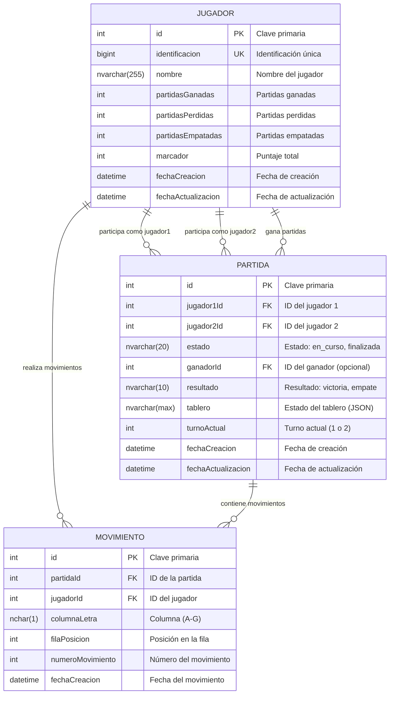

# 🎮 Connect4 - Proyecto Final

Juego Connect4 desarrollado con Node.js, TypeScript y SQL Server con arquitectura moderna y organizada.

## 👨‍💻 Estudiantes
- **Josue Calderon Barrantes FI20019605**
- **Darrel Sanchez Villalobos FI23029796**
- **Jose Pablo Vega Valverde FI23030050** 
## 🚀 Tecnologías Utilizadas

- **Backend**: Node.js + Express + TypeScript
- **Base de Datos**: SQL Server + Prisma ORM
- **Frontend**: HTML5 + CSS3 + JavaScript (Vanilla)
- **Herramientas**: nodemon, ts-node, Prisma Studio

## 🛠️ Frameworks y Herramientas Detalladas

### **Backend**
- **Express.js**: Framework web para Node.js
- **TypeScript**: Superset de JavaScript con tipado estático
- **Prisma ORM**: Moderno ORM para SQL Server
- **cors**: Middleware para manejo de CORS
- **nodemon**: Herramienta de desarrollo para reinicio automático
- **ts-node**: Ejecutor directo de TypeScript

### **Base de Datos**
- **SQL Server**: Sistema de gestión de bases de datos relacionales de Microsoft
- **Prisma Client**: Cliente generado automáticamente para interacción con BD
- **Prisma Studio**: Interfaz gráfica para explorar y editar datos

### **Frontend**
- **HTML5**: Estructura semántica moderna
- **CSS3**: Estilos avanzados con Flexbox y Grid
- **JavaScript (Vanilla)**: Sin frameworks, JavaScript puro
- **API Fetch**: Para comunicación con el backend

### **Herramientas de Desarrollo**
- **PowerShell Scripts**: Automatización de configuración
- **npm**: Gestor de paquetes y scripts
- **Git**: Control de versiones

## 🏗️ Tipo de Aplicación

**SPA (Single Page Application)**

La aplicación es una **Single Page Application** que:
- Carga una sola página HTML (`index.html`)
- Maneja la navegación dinámicamente con JavaScript
- Utiliza diferentes "pantallas" que se muestran/ocultan según la acción del usuario
- Comunica con el backend a través de APIs REST sin recargar la página
- Mantiene el estado de la aplicación en el lado del cliente

## 🏛️ Arquitectura del Sistema

**MVC (Model-View-Controller)**

La aplicación sigue el patrón **MVC** con separación clara de responsabilidades:

### **📊 Models (Modelos)**
- **Ubicación**: `src/backend/models/`
- **Responsabilidad**: Definición de estructuras de datos y lógica de dominio
- **Archivos**: `Jugador.ts`, `Partida.ts`, `JugadorSimple.ts`

### **🎨 Views (Vistas)**
- **Ubicación**: `src/frontend/`
- **Responsabilidad**: Interfaz de usuario y presentación
- **Componentes**: HTML, CSS, JavaScript del cliente

### **🎯 Controllers (Controladores)**
- **Ubicación**: `src/backend/controllers/`
- **Responsabilidad**: Lógica de negocio y manejo de peticiones
- **Archivos**: `JugadorControlador.ts`, `PartidaControlador.ts`, `EscalafonControlador.ts`

### **🛣️ Routes (Rutas)**
- **Ubicación**: `src/backend/routes/`
- **Responsabilidad**: Definición de endpoints y enrutamiento
- **Archivos**: `jugadores.ts`, `partidas.ts`, `escalafon.ts`, `consultar-nombre.ts`

### **🔌 API REST**
- Comunicación cliente-servidor mediante HTTP
- Formato JSON para intercambio de datos
- Endpoints RESTful bien definidos

## 🗄️ Diagrama de Base de Datos

La base de datos utiliza **SQL Server** con las siguientes entidades principales:

### 📊 Diagrama de Entidad-Relación



### 🎯 Relaciones Principales

- **Jugador ↔ Partida**: Un jugador puede participar en múltiples partidas como jugador1 o jugador2
- **Jugador ↔ Partida**: Un jugador puede ganar múltiples partidas (relación opcional)
- **Jugador ↔ Movimiento**: Un jugador puede realizar múltiples movimientos
- **Partida ↔ Movimiento**: Una partida contiene múltiples movimientos (cascade delete)

### **Descripción de Entidades**

#### **🎮 Jugador**
- **Propósito**: Almacena información de los jugadores registrados
- **Campos clave**: identificación única, estadísticas de partidas, marcador
- **Relaciones**: Puede participar en múltiples partidas y realizar movimientos

#### **⚔️ Partida**
- **Propósito**: Representa una partida de Connect4 entre dos jugadores
- **Campos clave**: estado del juego, tablero (JSON), turno actual
- **Relaciones**: Conecta dos jugadores y contiene múltiples movimientos

#### **🎯 Movimiento**
- **Propósito**: Registra cada movimiento realizado en una partida
- **Campos clave**: posición (columna + fila), número de secuencia
- **Relaciones**: Pertenece a una partida específica y un jugador

## 📁 Estructura del Proyecto

```
Connect4/
├── src/
│   ├── backend/              # 🎯 Lógica del servidor
│   │   ├── controllers/      # Controladores REST
│   │   ├── models/           # Modelos de datos
│   │   ├── routes/           # Rutas de la API
│   │   ├── services/         # Servicios de negocio
│   │   ├── middleware/       # Middleware personalizado
│   │   ├── utils/           # Utilidades
│   │   └── app.ts           # Aplicación principal
│   ├── frontend/            # 🎨 Interfaz de usuario
│   │   ├── css/            # Estilos
│   │   ├── js/             # JavaScript del cliente
│   │   └── index.html      # Página principal
│   └── types/              # 📝 Tipos TypeScript compartidos
├── prisma/                 # 🗄️ Esquema de base de datos
├── docs/                   # 📚 Documentación
├── config/                 # ⚙️ Configuraciones
├── scripts/                # 🔧 Scripts de desarrollo
└── tests/                  # 🧪 Pruebas
```

## ⚡ Configuración Rápida

### 1. **Instalación y Configuración**
```bash
# Clonar repositorio
git clone https://github.com/rjwrld/Connect4.git
cd Connect4

# Configuración automática (recomendado)
npm run setup
```

### 2. **Configuración Manual**
```bash
# Instalar dependencias
npm install

# Crear archivo .env
# Ver: config/database.md para instrucciones detalladas

# Ejecutar migraciones
npm run db:migrate

# Generar cliente Prisma
npm run db:generate
```

## 🎯 Comandos Disponibles

### **Desarrollo**
```bash
npm run dev           # Iniciar servidor en modo desarrollo
npm run quick-start   # Inicio rápido con verificaciones
npm run build         # Compilar TypeScript
npm run start         # Iniciar servidor en producción
```

### **Base de Datos**
```bash
npm run db:generate   # Generar cliente Prisma
npm run db:migrate    # Crear y aplicar migraciones
npm run db:push       # Sincronizar schema sin migración
npm run db:reset      # Resetear base de datos
npm run db:studio     # Abrir Prisma Studio
```

### **Pruebas y Utilidades**
```bash
npm test              # Probar conexión a BD
npm run setup         # Configuración inicial completa
```

## 🎮 Funcionalidades del Juego

### **Características Principales**
- ✅ **Crear Jugador**: Registro con identificación única
- ✅ **Crear Partida**: Inicio de nueva partida entre dos jugadores  
- ✅ **Cargar Partida**: Continuar partidas existentes
- ✅ **Escalafón**: Ranking dinámico de jugadores

### **Lógica del Connect4**
- 🎯 **Tablero**: 7 columnas (A-G) × 6 filas
- 🎯 **Objetivo**: Conectar 4 fichas consecutivas
- 🎯 **Detección automática**: Victoria, empate, movimientos válidos
- 🎯 **Estadísticas**: Actualización automática del marcador

## 🔗 API Endpoints

```
POST /api/jugadores              # Crear jugador
GET  /api/jugadores              # Listar jugadores
POST /api/partidas               # Crear partida
GET  /api/partidas               # Listar partidas
POST /api/partidas/:id/movimiento # Realizar movimiento
GET  /api/escalafon              # Obtener ranking
GET  /api/consultar-nombre/:id   # Consultar nombre de jugador
```

## 📋 Requisitos Previos

- **Node.js** (versión 18 o superior)
- **SQL Server** (Express, Developer, o Docker)
- **npm** o yarn

## 🗄️ Configuración de SQL Server

### **Opción 1: SQL Server Local**
1. Habilitar **TCP/IP** en SQL Server Configuration Manager
2. Configurar puerto **1433**
3. Usar **Windows Authentication** o **SQL Authentication**

### **Opción 2: Docker**
```bash
docker run -e "ACCEPT_EULA=Y" -e "MSSQL_SA_PASSWORD=TuPassword123!" \
  -p 1433:1433 --name sqlserver \
  -d mcr.microsoft.com/mssql/server:2022-latest
```

### **Variables de Entorno (.env)**
```env
# Windows Authentication (recomendado)
DATABASE_URL="sqlserver://localhost:1433;database=Connect4DB;integratedSecurity=true;encrypt=true;trustServerCertificate=true"

# SQL Authentication
DATABASE_URL="sqlserver://localhost:1433;database=Connect4DB;user=sa;password=TuPassword123!;encrypt=true;trustServerCertificate=true"

PORT=3000
NODE_ENV=development
```

## 📊 Estado del Proyecto

- **Backend**: ✅ 100% funcional
- **Base de Datos**: ✅ Esquema completo con migraciones
- **API**: ✅ Totalmente documentada y probada
- **Frontend**: ⚠️ Estructura básica (JavaScript pendiente)

## 🔧 Scripts de Desarrollo

### **PowerShell Scripts**
```bash
# Configuración inicial automática
.\scripts\setup.ps1

# Inicio rápido con verificaciones
.\scripts\start.ps1
```

## 📚 Documentación Adicional

- 📖 **[Guía de Desarrollo](docs/GUIA_DESARROLLO.md)** - Documentación técnica completa
- 🗄️ **[Configuración SQL Server](config/database.md)** - Instrucciones detalladas de BD
- 📝 **[Migración SQL Server](docs/MIGRATION_SQLSERVER.md)** - Proceso de migración
- 🎯 **[Entrega del Proyecto](docs/ENTREGA_COMPANEROS.md)** - Información para compañeros


---

**🎮 ¡Disfruta jugando Connect4!** 